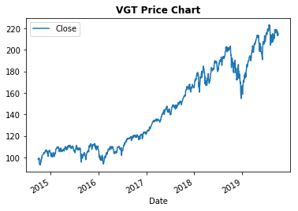
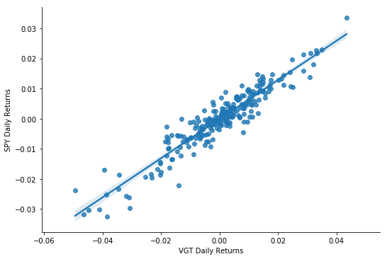
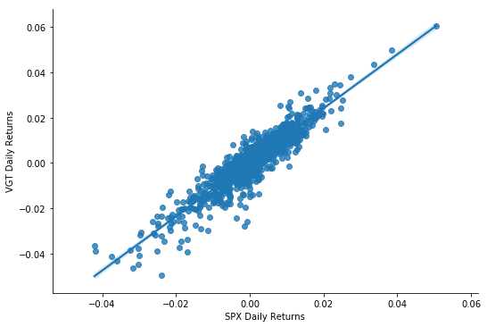
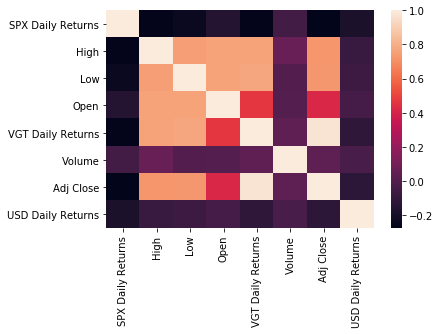
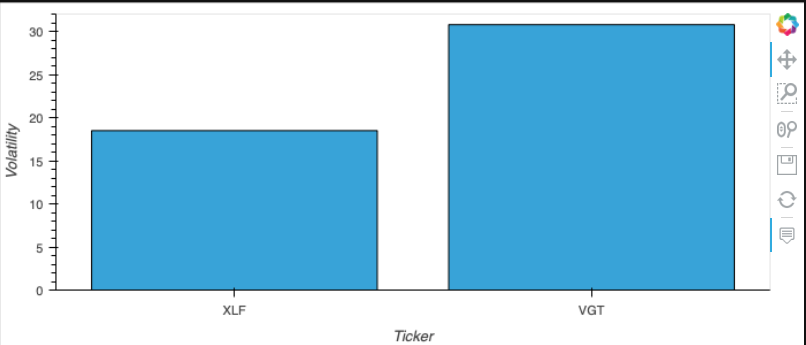
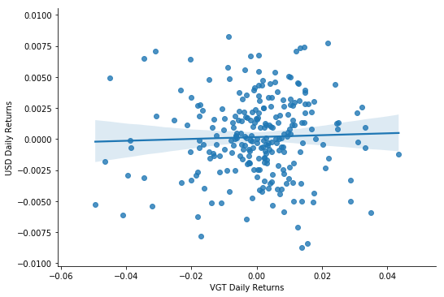
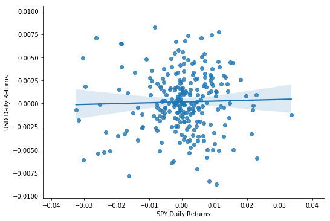
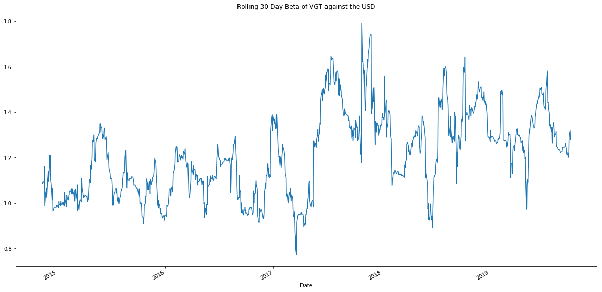
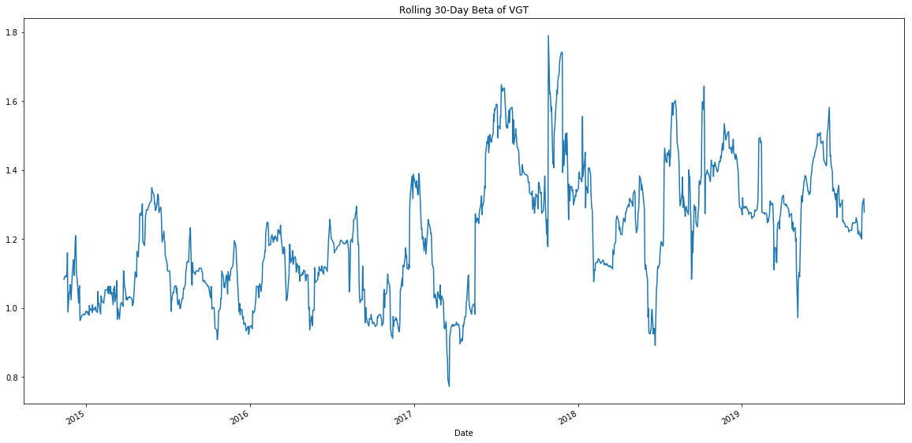
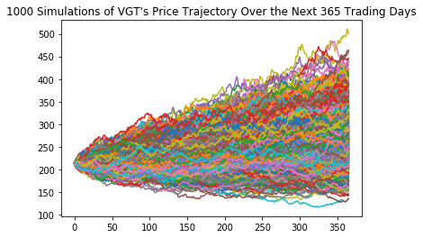

# Project-1
In this Repo, Jake and I will have our first Fintech Project

# Motivation & Summary 
Questions explored in this analysis:

How different are two of todays most popular ETFs? The SPDR S&P 500 etf vs. the VGT Vangaurd IT ETF 
Over the last three years, how much correlation is there in these ETFs? 
How do these ETF's compare against other stable assets?
How does volume effect pricing? When are bull / bearish markets? 
If these funds daily trading history were to continue its pattern and purely price movements are a predictor of future results, what are their expected forward return, and range of outcomes within a given confidence interval? 

### 1. How different are two of todays most popular ETFs? The SPDR S&P 500 etf vs. the VGT Vangaurd IT ETF 

### 2. Over the last three years, how much correlation is there in these ETFs? 

### 3. How do these ETF's compare against other stable assets?

### 4. How does volume effect pricing? When are bull / bearish markets?

### 5. If these funds daily trading history were to continue its pattern and purely price movements are a predictor of future results, what are their expected forward return, and range of outcomes within a given confidence interval? 

